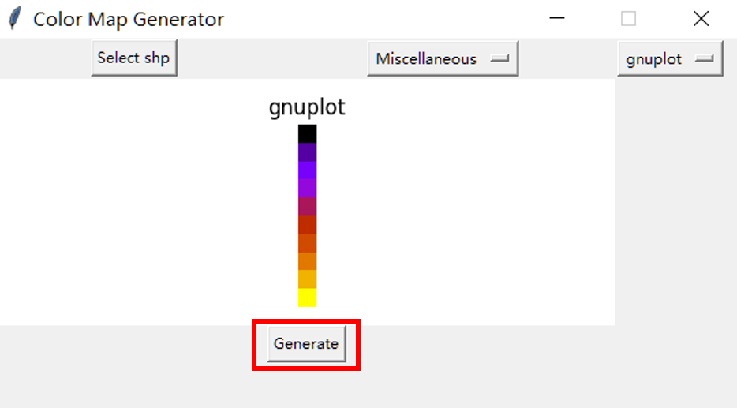

# Color-Map-Generator
**用来生成不同颜色组合的彩色地图**

## 数据来源
（1）颜色组合参考Matplotlib：
https://matplotlib.org/3.3.0/gallery/color/colormap_reference.html#sphx-glr-gallery-color-colormap-reference-py

（2）底图数据来自中科院全球国家行政边界数据：
https://www.resdc.cn/Default.aspx  
选择【全球100万基础地理数据】分类下面的【全球国家行政边界数据】下载解压

## 核心Python包
（1）folium == 0.16.0

（2）geopandas == 0.14.3

（3）matplotlib == 3.8.4

## 使用方法
（1）选择底图.shp文件

（2）选择颜色组合

（3）点击“Generate”按钮，选择结果文件的目标文件夹

（4）生成对应的地图html文件（map.html）

## 注意事项
（1）请使用data文件夹下的“世界国家.shp”作为底图数据

（2）因个人实验需要，底图设置为仅显示中国及周边邻国，如需更改请修改“main.py”中的代码

（3）“color.py”用于为不同国家分配颜色，“GUI.py”用于显示用户界面
